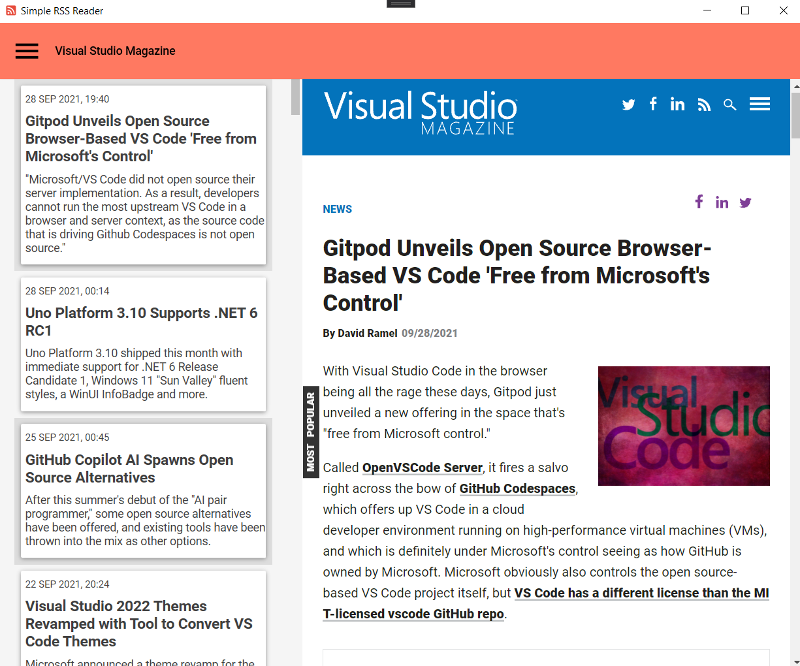
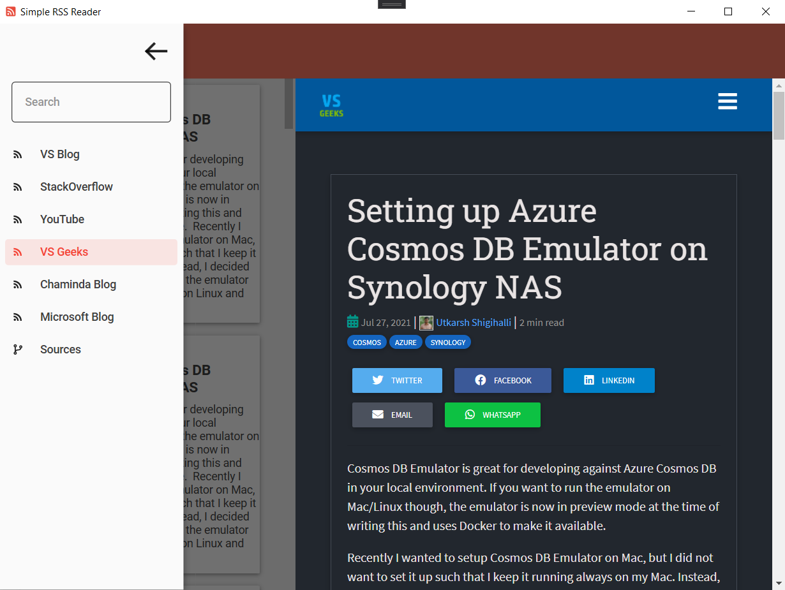

# SimpleRSSReader

## 1. Opis

SimpleRssReader je aplikacija koja omogućava jednostavno praćenje web-bazirinah vijesti i sadržaja sa web stranica. Aplikacija omogućeje korisniku da prati svoje omiljene web stranica bez da ih posjećuje zasebno.

## 2. Upotreba

Prilikom pokretanja aplikacije prikazaju se ekran kao na slici:

Na lijevoj strani ekrana nalazi se lista objava sa kratkim opisom. Odabirom objave iz liste na desnoj strani ekrana prikazuje se originalna objava u ugradjenom pretrazivacu.

Otvaranjem menija prikazuje se lista izvora objava. Odakle mozemo birati sa kojeg izvora zelimo citati objave.

Upravljanje izvorima vijesti vrsimo odabirom stavke **Sources** iz menija. Izgled ekrana Sources je prikazan slici ispod i na njemu mozemo da dodajemo i brisemo izvore vijesti/objava.

